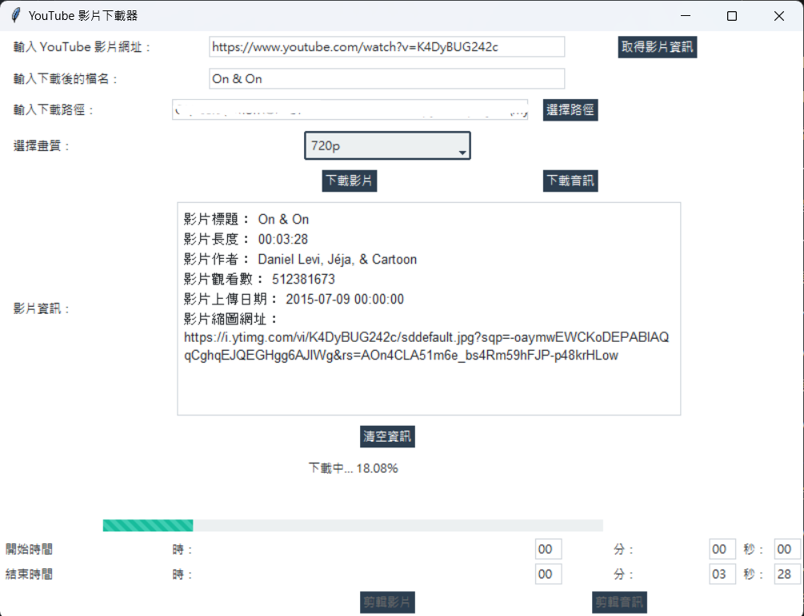
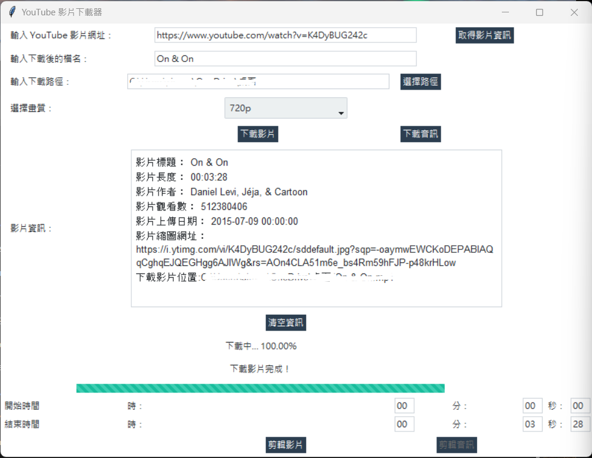
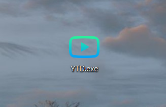

# YTD

Download mp3 or mp4 on youtube.

## Package
  * tkinter
  * tkkbootstrap
  * pytube
  * moviepy

## Code
 * [cutyt.py](cutyt.py) is the final code. You can run this code on python environment.
 * [hide_console.py](hide_console.py) is to package as an exe file. Don't run it directly!!!!!!!!!

## Set
 1. Run [cutyt.py](cutyt.py) ,and there will be a GUI.
 2. Fill in the comboxes with some links. And click "取得影片資訊" button.
    * It can be a playlist's url OR only one video's url.
 4. Get the information of link.
 5. Change the path to save and select the Image quality(If video download).
 6. Click the type to download (.mp3 or .mp4).
 7. Fill in another link and jump into the loop (Download another video/audio again and again~).

## Function
 * Download audio & video.
 * Check the video's detail.
 * Download youtube's playlists.
 * Cut video OR cut audio.
 * Choose the quality.

## Demo:
* Running
 >

* Success
 >

## If you want a exe file to easily use the tool...
* To the path
  ```
  cd "the code [hide_console.py]'s path"
  ```
* Package ~
  ```
  pyinstaller hide_console.py --icon=a9mz0-dsomv-001.ico --name=YTD --onefile --paths="C:.......\Python\Python39\site-packages" 
  ```
* And after you will see the exe in dist file:
  >You can click to do everything above!!!
  >
  >
